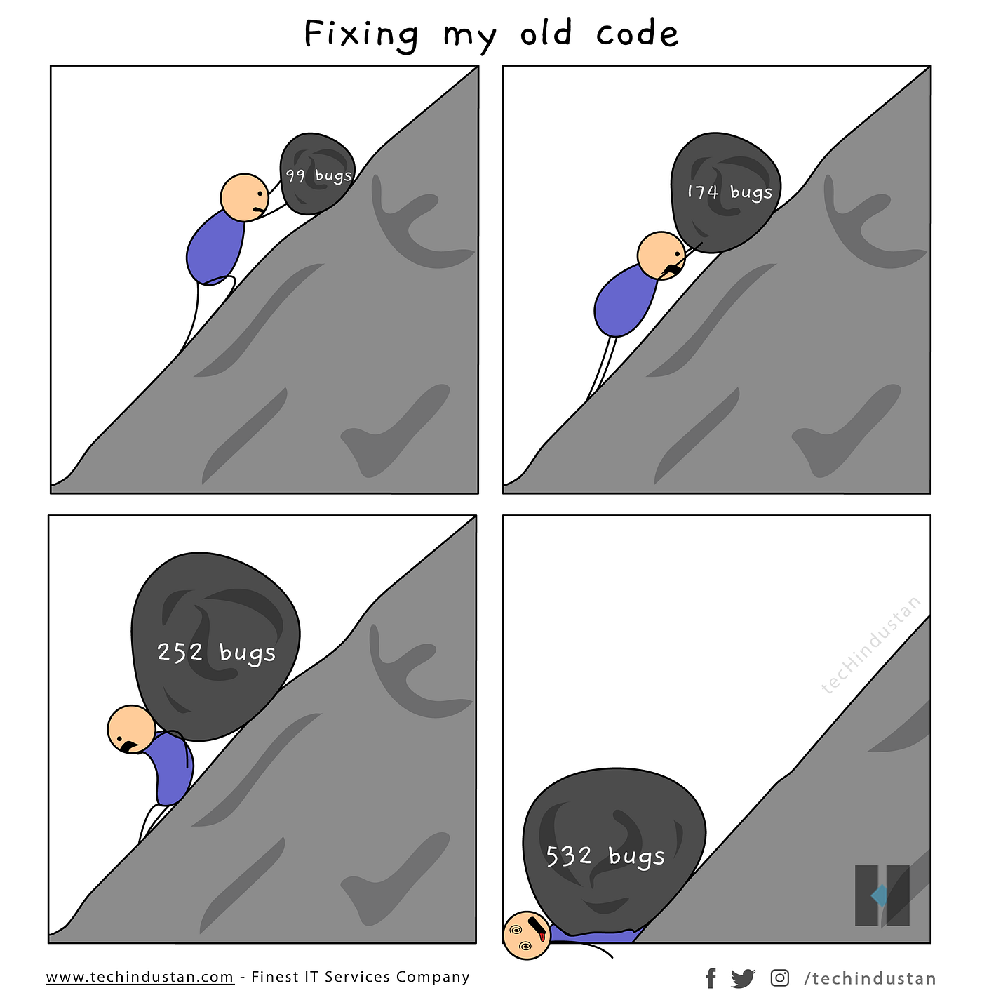

  <table style="border: none; background: none; margin: 0 auto;">
    

    
    
    
  

    <tr>
<!--       <td style="vertical-align: middle; border: none; background: none; padding-right: 25px; text-align: center;">
        
      </td> -->
      <td style="vertical-align: middle; border: none; background: none; padding-right: 25px; text-align: center;">
        <code style="font-size:3em; font-weight: bold; letter-spacing: 5px;"><strong>「 Hi 👋, I'm Mahdi 」</strong></code>
      </td>
      <td style="vertical-align: middle; border: none; background: none; text-align: center;">
        
      </td>
    </tr>
  </table>

  

  <h2 align="center">
    
  </h2>

 

  

    
    
    
    
  

<h2 align="center"> GitHub Stats</h2>

  <table width="100%">
    <tr>
      <td width="100%" align="center" style="padding: 0; background-color: #1A1B27;">
        
      </td>
    </tr>
  </table>

  <table width="100%">
    <tr>
      <td width="55%" align="center" style="padding: 0; background-color: #1A1B27;">
        
      </td>
      <td width="40%" align="center" style="padding: 0; background-color: #1A1B27;">
        
      </td>
    </tr>
  </table>

 

    A motivated Computer Science student with a passion for cloud infrastructure, distributed systems, and performance optimization. Currently building secure, scalable web applications with modern technologies and cloud-native architecture.
  

<h2 align="center">🛠️ My Tech Stack</h2>

<h3 align="center">Programming Languages</h3>

  
  
  
  
  
  

<h3 align="center">Cloud & DevOps</h3>

  
  
  
  
  
  
  

<h3 align="center">Frontend Development</h3>

  
  
  
  

<h3 align="center">Backend Development</h3>

  
  
  
  
  

<h3 align="center">Databases</h3>

  
  
  
  
  
  

<h3 align="center">Other Tools & Technologies</h3>

  
  
  
  
  
  

<h2 align="center">🏆 Certifications</h2>

  
   
  

<h2 align="center">🎓 Education</h2>

  <strong>Bachelor of Science in Computer Science</strong>
   
  University at Buffalo
   
  <em>Expected Graduation: Jan 2028 (Accelerating coursework — may graduate as early as 2026–2027)</em>

  

  <small>🏙️ Buffalo, NY </small>

